# 🏢 OfficeMG — Office Management & Billing System

**OfficeMG** is a professional desktop-based Office Management System built using **Python**, **Tkinter**, **SQLite** and **ReportLab**.
It provides complete tools for managing daily business operations—billing, challans, ledger tracking, product inventory, customer management and PDF report generation.


## 📌 Overview

officeMG is designed for small and medium offices that require fast billing, challan creation, payment tracking and inventory management without complex ERP systems.
The application comes with a clean Tkinter UI, lightweight architecture and professional PDF outputs powered by ReportLab.


## ✨ Features

### 🔐 Authentication

- System configuration
- Login system with SQLite
- Secure credential validation

### 🧾 Billing System

- Create, update, and manage bills
- Auto-calculation of totals
- Save to database
- Generate PDF bills using ReportLab
- Reprint old bills

### 📦 Challan Management

- Create auto challan or custom challan
- Generate PDF challan
- Maintain challan history

### 📚 Ledger (Debit / Credit)

- Customer-wise ledger tracking
- Debit/Credit entry
- Outstanding balance summary
- PDF ledger report

### 👥 Customer Management

- Add/Edit/Delete customers
- Store customer basic info
- View billing and ledger history

### 💰 Collection Modules

- Bill collection management
- UT collection
- Payment history

### 📦 Product Store Management

- Add or update products
- Manage stock quantity
- Product pricing control

### 🖨️ PDF Report System

_`(All reports generated using ReportLab)`_

- PDF Bill, Challan
- PDF Statement, Due Balance
- PDF Ledger, Products
- Clean professional layout


## 🛠️ Technologies Used

| Area | Technology |
|------|------------|
| **Language** | Python |
| **GUI Framework** | Tkinter |
| **Database** | SQLite |
| **PDF Generation** | [ReportLab](https://docs.reportlab.com/) |
| **File Export** | PDF |


## 🧰 Installation

### Step 1. Clone the repository

```bash
git clone https://github.com/iamx-ariful-islam/OfficeMG.git
cd OfficeMG
```

### Step 2. Install Python Dependencies

The `requirements.txt` file, lists of all the Python libraries that "**_OfficeMG_**" depends on and installs those packages from the file:

```bash
pip install -r requirements.txt
# or
sudo pip install -r requirements.txt
```

### Step 3. Run the Application
```bash
python main.py
```


## 📂 Folder Structure

Here’s the structure of the **OfficeMG** project:

```bash
OfficeMG/
│
├── Screenshots/
├── main.py
├── notes.txt
│── LICENSE
│── README.md
└── requirements.txt
```


## 🖼️ Screenshots

Here are some screenshots of the `OfficeMG` project:

**System Configure**<br/>
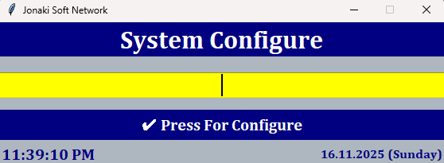<br/>
**Admin Login**<br/>
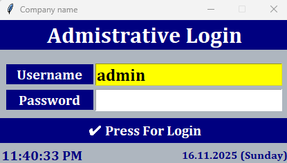<br/>
**Main Window**<br/>
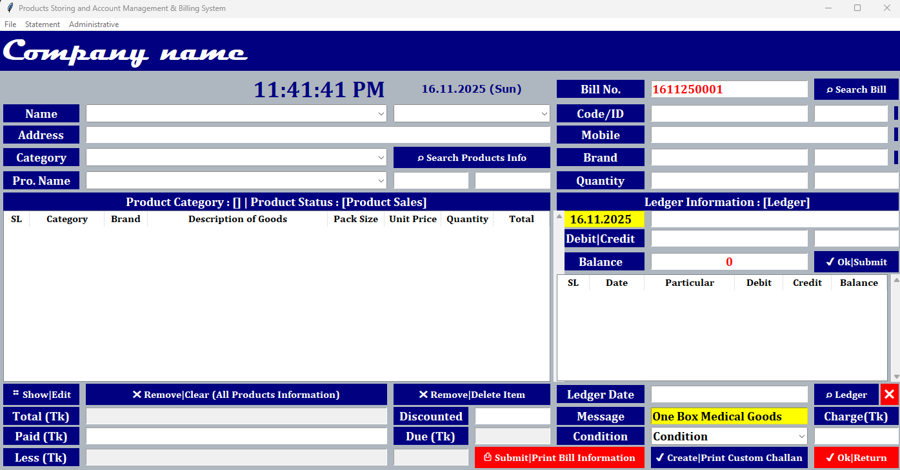<br/>
**Bill Payment**<br/>
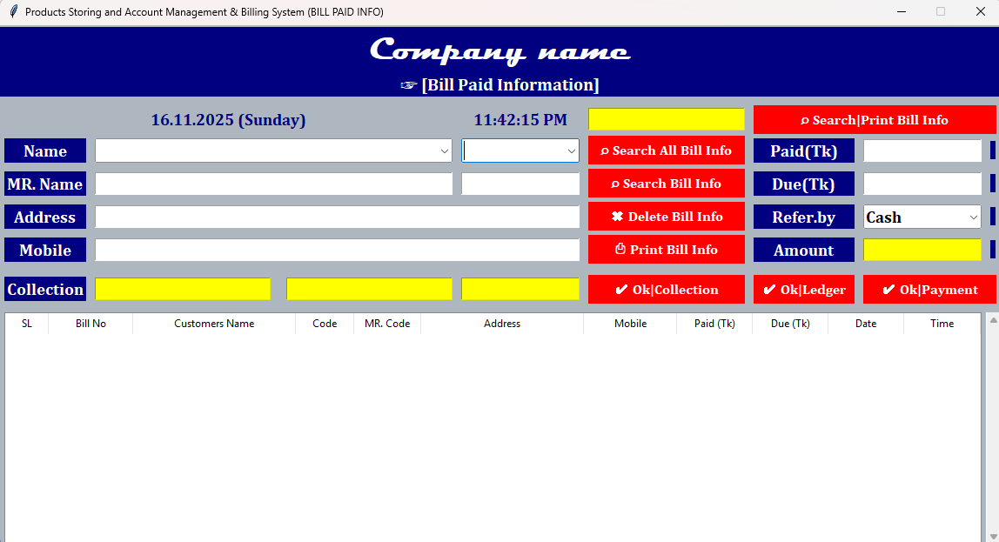<br/>
**Bill-UT Collection**<br/>
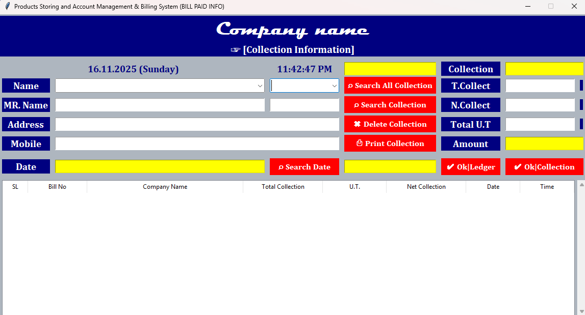<br/>
**Bill Information**<br/>
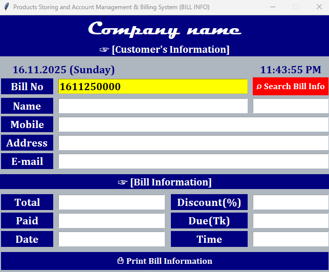<br/>
**Products Purchase**<br/>
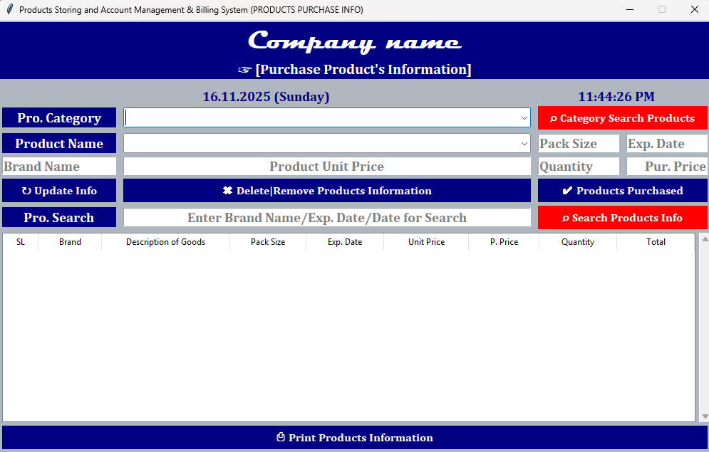<br/>
**Customers Information**<br/>
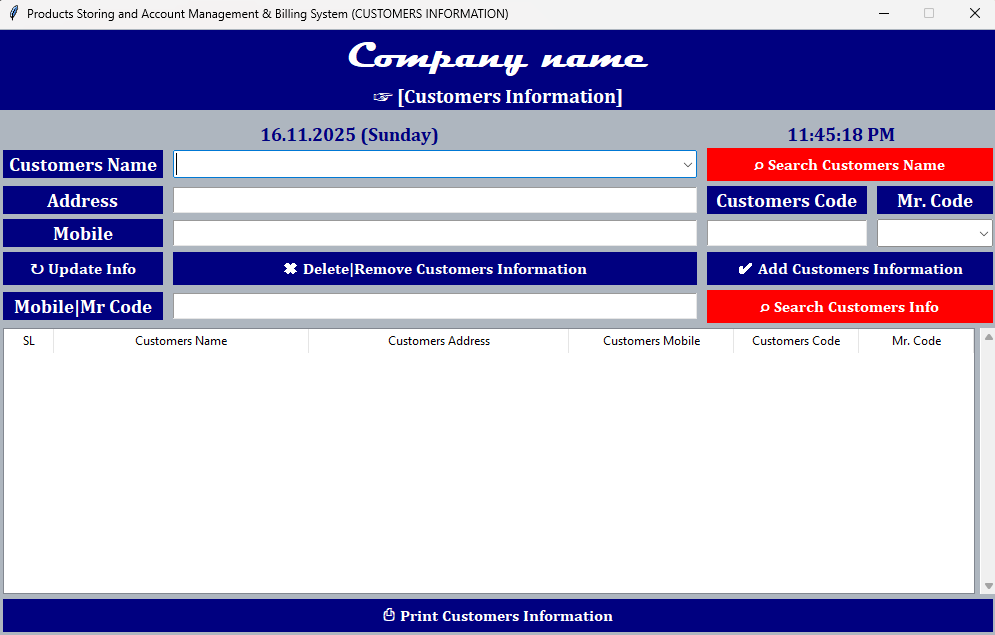<br/>
**Settings**<br/>
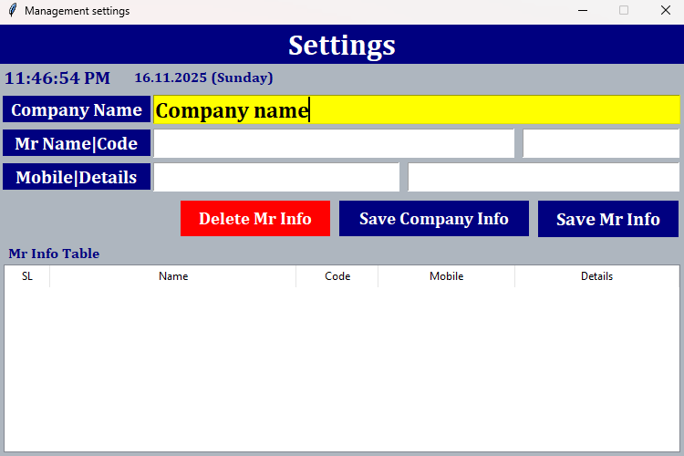<br/>
**Change Password**<br/>
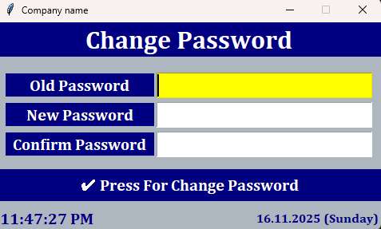<br/>
**Bill**<br/>
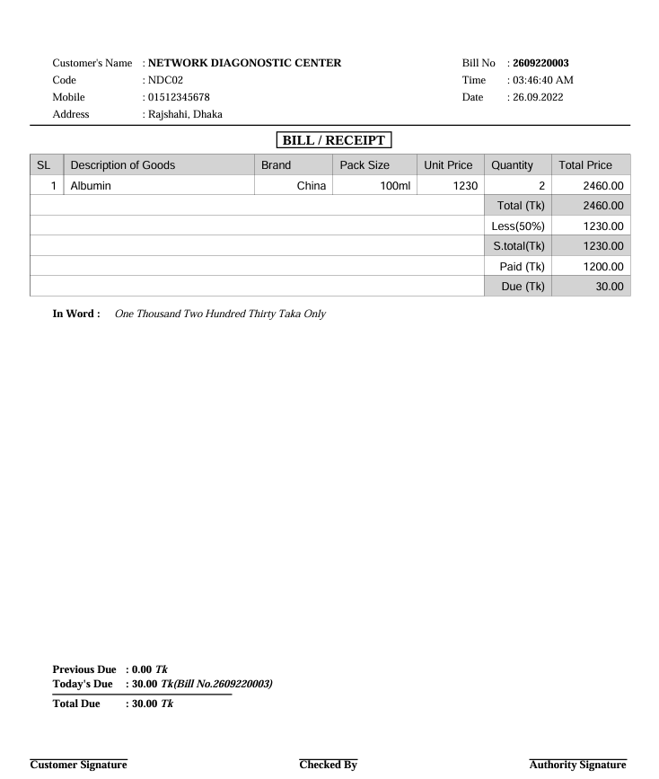<br/>
**Challan**<br/>
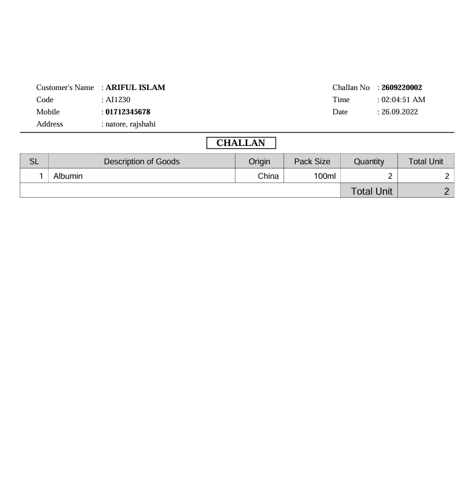<br/>
**Bill Statement**<br/>
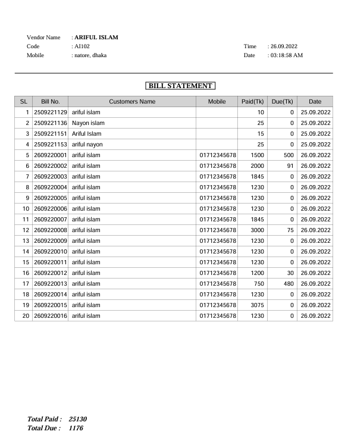<br/>
**Due Bill Statement**<br/>
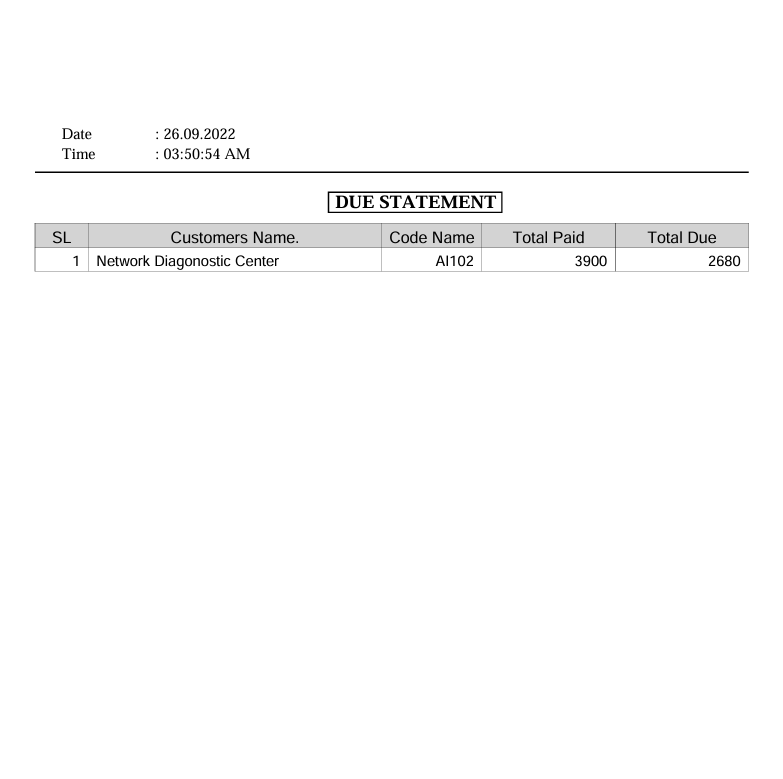<br/>
**Products Statement**<br/>
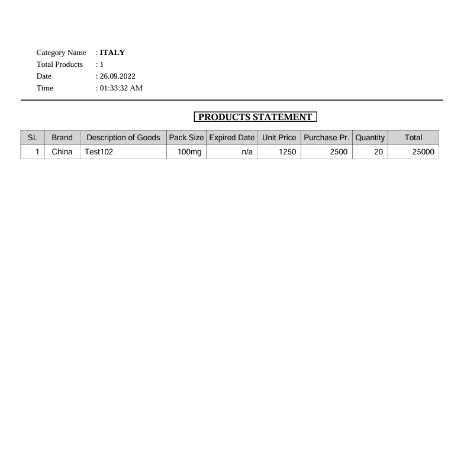<br/>


## 🤝 Contributing

Contributions, suggestions, and feedback are always welcome! ❤️<br/>
To contribute:

1. Fork the repository
2. Create a new branch (`feature/new-feature`)
3. Commit your changes
4. Push and submit a Pull Request

💬 You can also open an issue if you’d like to discuss a feature or report a bug.


## 🌐 For more or connect with me

<p align='center'>
  <a href="https://github.com/iamx-ariful-islam"></a>&nbsp;&nbsp;
  <a href="https://bd.linkedin.com/in/iamx-ariful-islam"></a>&nbsp;&nbsp;
  <a href="https://x.com/mx_ariful_islam"></a>&nbsp;&nbsp;
  <a href="https://www.facebook.com/iamx.ariful.islam/"></a>
</p>


## 📜 License

The [MIT](https://choosealicense.com/licenses/mit/) License (MIT)


## 💖 Thank You for Visiting!

> “Good design is about making things simple yet significant”  
> — *Md. Ariful Islam*